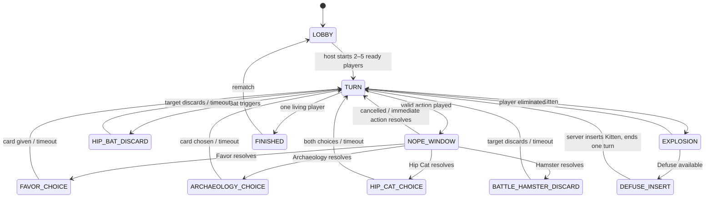

# Kiến trúc và giao thức

## Ranh giới dữ liệu

`packages/shared` contains stable card identifiers, Zod input schemas, event and snapshot types. `packages/engine` owns the full deck, hands, RNG, phases and pure state transitions. `apps/server` owns rooms, guest sessions, serialized intent processing, deadlines and filtered Socket.IO delivery. `apps/web` renders a viewer's snapshot, translates event keys locally and stores language, visual style and audio preferences on that browser.

The server is authoritative. A browser never receives the draw order, another player's hand, a secret Hip Cat choice, or the middle insertion slot. Each physical card has an `instanceId`; translated labels are display data only. A spectator receives a spectator snapshot and public events. An eliminated player's unrevealed hand remains server-only; their client receives an empty hand and cannot play. Permitted historical knowledge is retained until an effect invalidates it.

The diagram describes logical transitions; `EXPLOSION` is a server-side resolution step and need not be a long-lived socket phase. The exact phase names and payload schema are in `packages/shared/src/index.ts`.

## Socket.IO protocol

All inbound messages use an acknowledgement callback returning `{ok:true,...}` or `{ok:false,error:{code,params?}}`. All errors are codes translated by the client. Every inbound payload is validated with Zod and rate limited. The current schemas live in `apps/server/src/schemas.ts`.

| Client event | Payload | Purpose |
| --- | --- | --- |
| `session:open` | `{token?,nickname?}` | Create or resume a random guest token; token stays in this browser. |
| `room:create` | `{options?}` | Create lobby and join as host. |
| `room:join` | `{roomCode}` | Take or reclaim an available seat. |
| `room:watch` | `{roomCode}` | Join as spectator. |
| `room:leave` | `{}` | Leave current room. |
| `room:ready` | `{ready}` | Set lobby readiness. |
| `room:settings` | `{options:{mode,resurrection}}` | Host changes rules in lobby. |
| `room:start` | `{}` | Host starts a match. |
| `room:rematch` | `{}` | Host resets to lobby for another match. |
| `room:chat` | `{text}` | Send length-limited user chat. |
| `room:sync` | `{}` | Request latest filtered snapshot after an event gap. |
| `game:action` | `{gameId,turnId,actionId,expectedRevision,action}` | Submit one game intent. |

The server emits `room:snapshot` after joining and state changes, and `room:event` with sequence and revision for short animation/log playback. A client that sees a sequence gap calls `room:sync`. Retries of the same `actionId` return the earlier result. Different concurrent intents for one room are queued and checked against current revision/turn. Socket delivery alone is not treated as durable; reconnect resumes from a filtered snapshot.

The Engine.IO handshake checks an exact origin allowlist for HTTP polling and WebSocket. Native clients without an Origin header are allowed but still require a guest session and valid room/action authorization. An expired server deadline resolves before a late game packet is validated, independent of the periodic timer interval. Changing room rules clears readiness; starting requires every seat to be connected and ready. After 120 seconds without the host, an online player receives host control; in-game seats are retained for reconnect.

## Deployment boundary

### Room chat

`room:chat` accepts only `{text}` (trimmed, 1–240 characters). The server derives `playerId` and `playerName` from the authenticated guest session, adds the server timestamp `sentAt`, and publishes `chat.message` with `{playerId, playerName, text, sentAt}` using the room's sequence. Players, eliminated seats and spectators in that room can chat; sockets in other rooms receive nothing. Chat does not change the engine revision or deadline. It uses the room queue and existing token bucket (cost 5 per message).

The `room:snapshot` envelope includes `chatMessages`, a ring of the last 100 public chat events. It is separate from the 200-entry action/event history, remains across start and rematch, and restores on guest reconnect even after action history has rolled over. It contains only validated public chat text and sender metadata. The web renders it as escaped React text in `RoomSidebar.tsx`; system action logs remain separately translated. Mobile chat is a focus-trapped dialog with Escape/close and focus restoration; desktop uses an inline region. Unread counts exclude one's own messages and hydrated initial history. An open chat follows new messages only when already at the bottom, and does not mark incoming messages read while the tab is hidden.

The current server runs as one process with in-memory rooms and guest sessions. Docker Compose binds it to `127.0.0.1:3105` for a reverse proxy. This is suitable for one VPS instance and active browser sessions; a process restart loses unfinished matches. Multiple server instances require persistent room state, a distributed per-room lock/queue, durable event sequence, and the Socket.IO Redis adapter or another compatible adapter. The adapter alone would not make game state durable.

The Vite web build can be hosted by Vercel or an ordinary static server. Set `VITE_SERVER_URL` to the game server's HTTPS origin and `VITE_SOCKET_PATH` if a proxy uses a prefixed Socket.IO path. The backend must use `wss://` from an HTTPS web page.
# Hỗ trợ điều khiển trong bản cập nhật

- `packages/shared/src/play-policy.ts` là contract thuần cho SINGLE/PAIR/TRIPLE/PLUS_PLUS và loại mục tiêu. Engine dùng cùng contract với composer; engine tiếp tục kiểm tra quyền sở hữu, phase, mục tiêu, turn và revision.
- Snapshot envelope thêm `serverNow`; client bù sai lệch `Date.now()` để hiển thị deadline. Deadline được server quyết định và kiểm tra trước action; thanh thời gian chỉ là trình bày.
- Pending Nope công khai thêm `playKind`, `requestedType` của bộ ba và `passedPlayerIds`. Người xem biết người đánh, mục tiêu và loại bài đang được gọi tên trước khi quyết định Nope. Đây là thông tin hành động đã công khai; không chứa instanceId bí mật, tay bài hoặc vị trí chèn. Reconnect phục hồi nút Bỏ qua chính xác.
- `playAssist.ts` nhận public snapshot và private snapshot đã lọc của người chơi. `useAutoPlay.ts` gửi các intent bình thường, chờ 1,5 giây và kiểm tra lại game/turn/revision trước khi gửi. Mode tắt mặc định mỗi game, giới hạn ba lần đánh mỗi turn, dừng khi tab ẩn/offline hoặc chọn bài. Mọi kết quả vẫn do server áp dụng.
- Mutex request phía browser tránh bấm kép trong cùng lượt render; queue, revision và idempotency ở server tiếp tục là cơ chế bảo đảm đúng luật.
- SVG `CardScene.tsx` có 22 cảnh theo CardType; bốn module mèo được lazy load riêng. Danh tính bài, vị trí thông tin và kích thước không phụ thuộc style.
